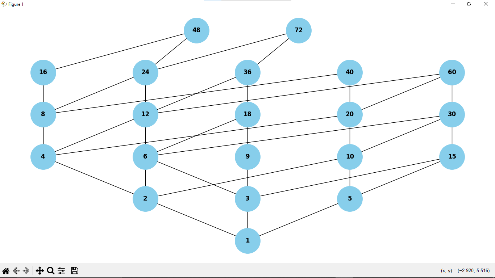
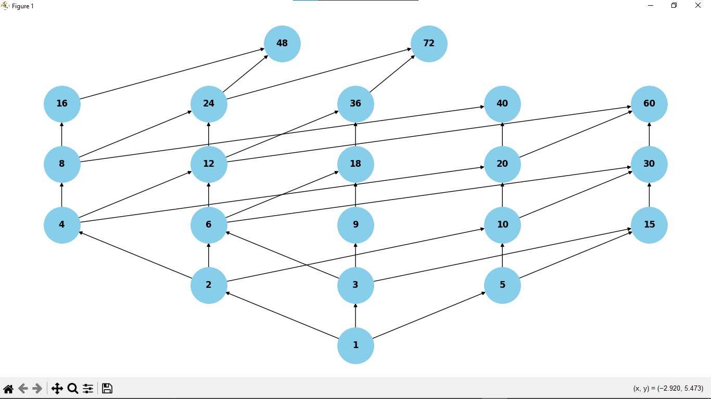
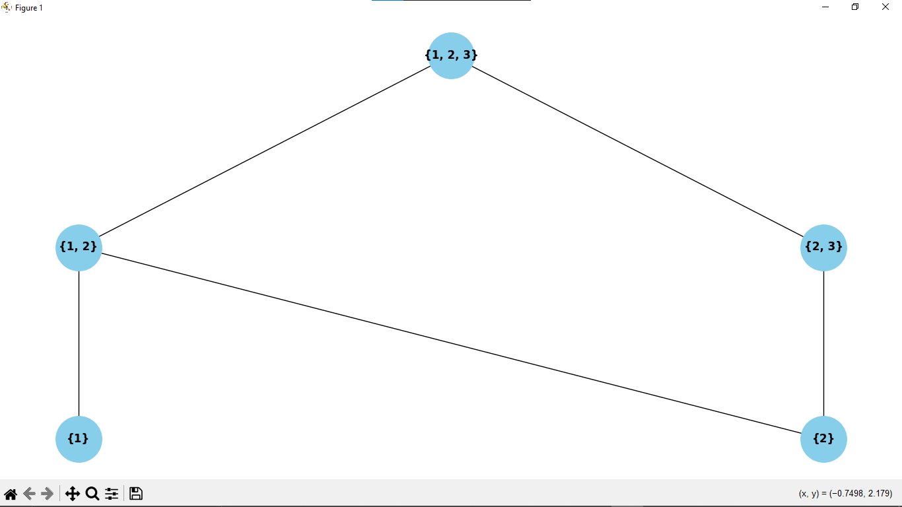
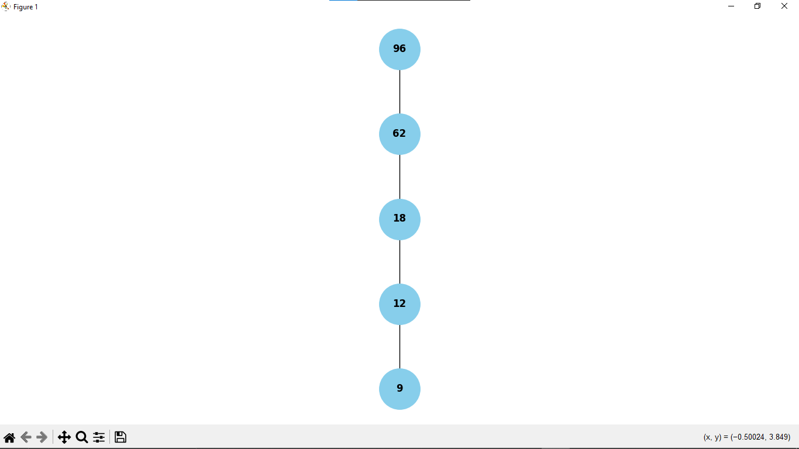
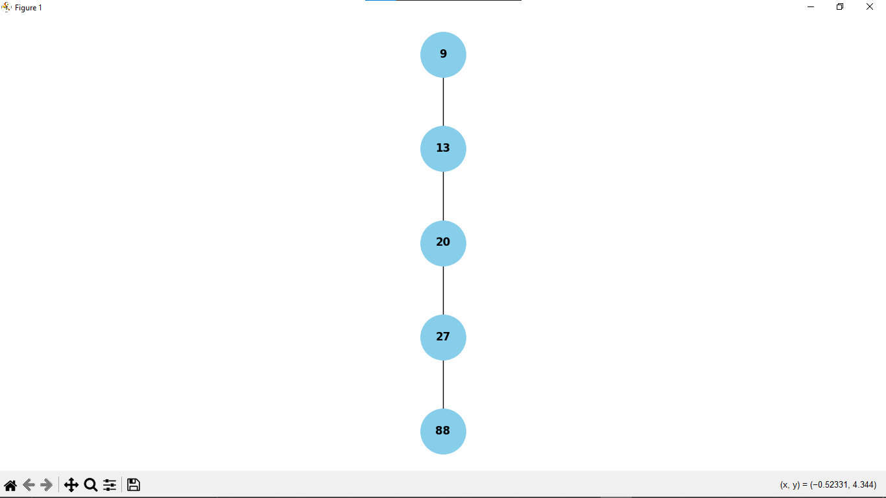
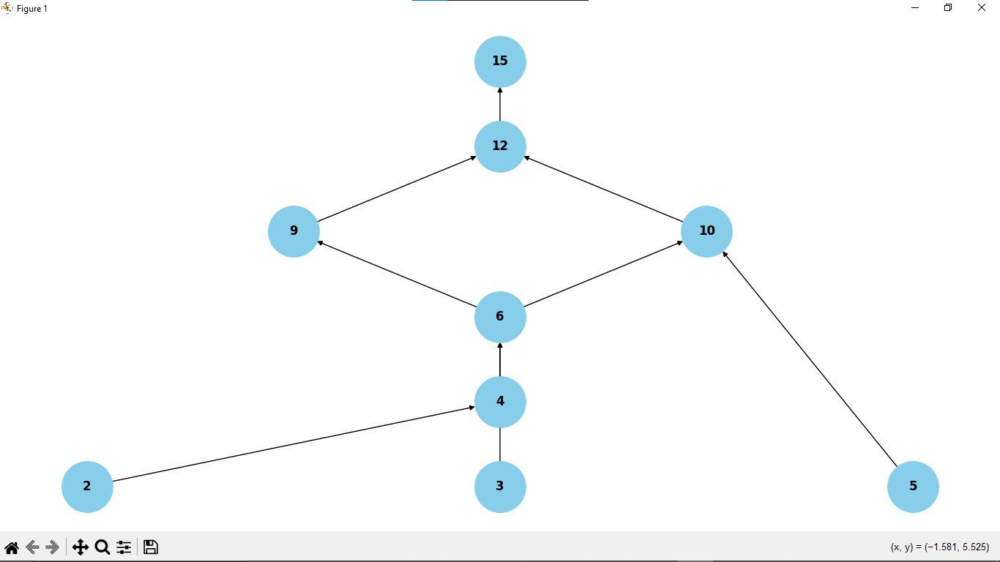

# Hasse Diagram Generator

This project generates Hasse diagrams for various relations, such as divisibility, subset, and comparison relations. The diagrams are visualized using `matplotlib` and `networkx`.

## Prerequisites

1. **Python Installation**:

    - Download and install Python from the [official Python website](https://www.python.org/downloads/).
    - Ensure that Python is added to your system's PATH during installation.

2. **Dependencies**:
    - The project requires the following Python libraries:
    - `networkx`
    - `matplotlib`

## Installation

1. Clone the repository using the following command:

    ```sh
    git clone https://github.com/Swar028363/hasse_diagram_generator.git
    ```

2. Navigate to the project directory:

    ```sh
    cd hasse_diagram_generator
    ```

3. Install the required dependencies by running:
    ```sh
    pip install -r requirements.txt
    ```

## Usage

1. Ensure all dependencies are installed as mentioned above.

2. Run the script to generate a Hasse diagram:

    ```sh
    python main.py
    ```

3. Follow the prompts to input the relation or dataset for which you want to generate the Hasse diagram.

4. The generated diagram will be displayed using `matplotlib` and saved as an image file in the project directory.

You can install these dependencies using `pip`.

## Output Examples

After running the script, the generated Hasse diagrams will be saved in the `images` folder. Below are some examples of the outputs along with the corresponding code snippets that generated them:

1. **Divisibility Relation**:
    ```python
    elements = [1, 2, 3, 4, 5, 6, 8, 9, 10, 12, 15, 16, 18, 20, 24, 30, 36, 40, 48, 60, 72]
    hasse_div = Hasse(elements, Hasse.divisibility_relation)
    hasse_div.draw()
    ```

   

2. **Divisibility Relation with Arrows**:
    ```python
    elements = [1, 2, 3, 4, 5, 6, 8, 9, 10, 12, 15, 16, 18, 20, 24, 30, 36, 40, 48, 60, 72]
    hasse_div = Hasse(elements, Hasse.divisibility_relation, show_arrows=True)
    hasse_div.draw()
    ```

   

3. **Subset Relation**:
    ```python
    elements = [{1}, {1, 2}, {1, 2, 3}, {2}, {2, 3}]
    hasse_sub = Hasse(elements, Hasse.subset_relation)
    hasse_sub.draw()
    ```

   

4. **Less Than or Equal Relation**:
    ```python
    elements = [12, 9, 62, 96, 18]
    hasse_leq = Hasse(elements, Hasse.less_equal_relation)
    hasse_leq.draw()
    ```

   

5. **Greater Than or Equal Relation**:
    ```python
    elements = [9, 13, 20, 27, 88]
    hasse_geq = Hasse(elements, Hasse.greater_equal_relation)
    hasse_geq.draw()
    ```

   

6. **GCD Prime Relation**:
    ```python
    elements = [2, 3, 4, 5, 6, 9, 10, 12, 15]
    hasse_gcd_prime = Hasse(elements, gcd_prime_relation, show_arrows=True)
    hasse_gcd_prime.draw()
    ```
    
   
